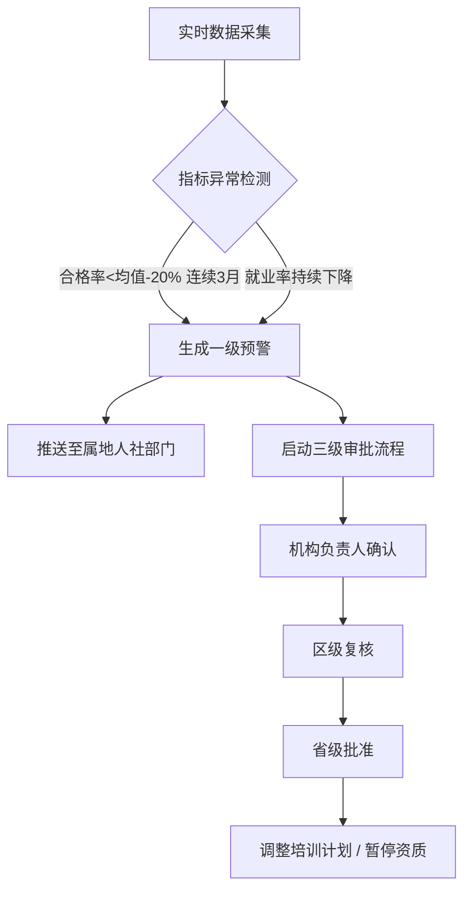
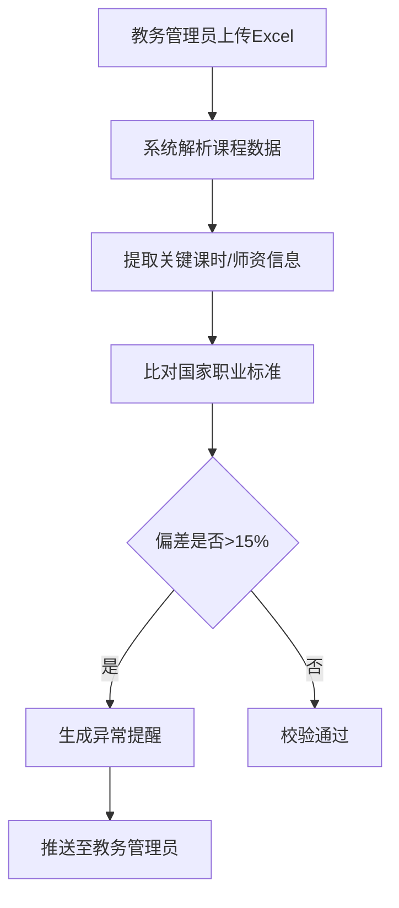

## 1. 产品概述

全国性职业培训与技能鉴定效能评估分析平台，面向国家、省、市三级人社部门及培训机构，实时采集并分析培训全链路数据，提供效能诊断、预警监控、数据可视化与智能决策支持。

- **核心目标**：构建培训质量监管体系，提升职业培训效能，促进就业转化率
- **目标用户**：人社部/厅/局培训科管理人员、培训机构负责人、教务管理员

## 2. 核心功能

### 2.1 用户角色与权限

| 角色 | 注册方式 | 核心权限 |
|------|----------|----------|
| 国家级管理员 | 系统分配 | 查看全国数据、配置预警规则、审批省级资质调整 |
| 省级管理员 | 系统分配 | 查看本省数据、复核区级审批、管理辖区机构 |
| 市级管理员 | 系统分配 | 查看本市数据、接收预警推送、执行区级复核 |
| 机构负责人 | 机构注册审批 | 查看本机构数据、确认预警、提交培训计划调整 |
| 教务管理员 | 机构分配 | 上传培训计划、接收课程异常提醒 |

### 2.2 功能模块

1. **核心数据看板**：全国培训热力图、合格率排名、省份下钻、出勤趋势、证书分布
2. **实时数据监控**：多源数据流接入、自动清洗、指标聚合计算
3. **预警管理中心**：一级预警推送、三级审批流程、资质暂停/恢复
4. **培训计划校验**：Excel上传、国家标准比对、异常提醒
5. **效能诊断报告**：周报自动生成、同比环比分析、优化方案推荐
6. **机构管理**：机构档案、资质管理、培训等级配置

### 2.3 页面详情

| 页面名称 | 模块名称 | 功能描述 |
|----------|----------|----------|
| 登录页 | 登录表单 | 账号密码登录、三级权限角色选择、验证码校验 |
| 核心看板 | 指标总览卡片 | 实时展示培训合格率、就业转化率、技能提升指数、证书发放及时率 |
| 核心看板 | 全国培训热力图 | 按省份着色显示培训规模，点击下钻至地市 |
| 核心看板 | 合格率排名榜 | 各省份/地市培训合格率升降排名 |
| 核心看板 | 出勤趋势曲线 | 近7天学员出勤率趋势折线图 |
| 核心看板 | 证书类型分布 | 各职业类别证书发放饼图/柱图 |
| 预警中心 | 预警列表 | 一级预警信息列表，状态筛选（待处理/处理中/已解决） |
| 预警中心 | 审批工作台 | 三级审批流程可视化，机构确认→区级复核→省级批准 |
| 预警中心 | 预警规则配置 | 配置预警阈值（合格率偏差、就业率下降周期） |
| 培训计划 | Excel上传 | 拖拽上传年度培训计划，进度显示 |
| 培训计划 | 校验结果 | 国家标准比对详情，异常项高亮标注 |
| 诊断报告 | 报告列表 | 按周生成的效能诊断报告归档 |
| 诊断报告 | 报告详情 | 合格率同比环比、就业去向分布、证书获取周期、优化建议 |
| 机构管理 | 机构列表 | 培训机构档案、资质状态、培训等级 |
| 机构管理 | 机构详情 | 机构历史数据、培训课程、学员统计 |

## 3. 核心流程

### 3.1 预警与审批流程

系统实时监控各机构培训数据，当检测到连续3个月培训合格率低于区域均值20%，或就业率持续下降时，自动触发一级预警。预警推送至属地人社部门培训科，同时启动三级审批流程：机构负责人确认问题并提交整改方案→区级人社部门复核→省级人社部门批准调整培训计划或暂停资质。

### 3.2 培训计划校验流程

教务管理员上传年度培训计划Excel文件，系统自动提取课程设置与师资配备信息，与国家职业标准数据库比对，当关键课时偏离超15%或师资配备不达标时，生成异常提醒并推送至教务管理员。

## 4. 用户界面设计

### 4.1 设计风格

- **主色调**：政务蓝 `#1e40af` 作为主色，搭配深蓝 `#1e3a8a` 和浅蓝 `#3b82f6` 作为辅助色
- **强调色**：预警橙 `#f97316`、警告红 `#ef4444`、成功绿 `#10b981`
- **背景色**：冷灰渐变 `#f8fafc → #f1f5f9`，深色卡片用 `#0f172a` 制造层次感
- **按钮风格**：圆角4px，微投影，悬停有轻微上浮动画
- **字体**：展示字体采用 Noto Serif SC（思源宋体）增强政务专业感，正文字体采用 Noto Sans SC（思源黑体）保证可读性
- **布局风格**：卡片式栅格布局，顶部导航+左侧菜单栏，数据密集区域采用紧凑表格
- **图标风格**：统一使用线性风格图标，尺寸16/20/24px三档

### 4.2 页面设计概览

| 页面名称 | 模块名称 | UI元素 |
|----------|----------|--------|
| 核心看板 | 指标总览卡片 | 深色渐变卡片背景，大号数字带千分位，趋势箭头带微动画，环形进度条 |
| 核心看板 | 全国培训热力图 | SVG中国地图，省份hover高亮，点击下钻浮层，颜色深浅映射培训密度 |
| 核心看板 | 合格率排名榜 | 带升降箭头的排名列表，前3名金银铜色高亮，滚动条自定义样式 |
| 预警中心 | 预警列表 | 紧急标签色彩分级，处理进度条，审批节点时间线 |
| 预警中心 | 审批工作台 | 水平流程步骤条，当前步骤发光，审批意见富文本框 |
| 诊断报告 | 报告详情 | 分章节折叠面板，图表与文字混排，数据对比用双柱图 |

### 4.3 响应式设计

- 采用 Desktop-first 设计，主断点1440px/1280px/1024px/768px
- 大屏（≥1440px）：4列指标卡 + 左侧250px菜单 + 主内容区
- 中屏（1024-1440px）：3列指标卡 + 左侧200px菜单
- 平板（768-1024px）：2列指标卡 + 折叠式汉堡菜单
- 移动端（<768px）：单列堆叠 + 底部Tab导航，图表简化显示

### 4.4 动效与交互

- 页面加载：指标数字从0滚动到目标值（countUp动画），卡片依次淡入（staggered reveal）
- 悬停交互：卡片轻微上浮（translateY -4px）+ 阴影加深，按钮背景色渐变过渡
- 数据刷新：指标数值变化时闪烁一次绿色/红色背景提示
- 地图交互：省份hover时描边发光，点击时缩放过渡到地市视图
