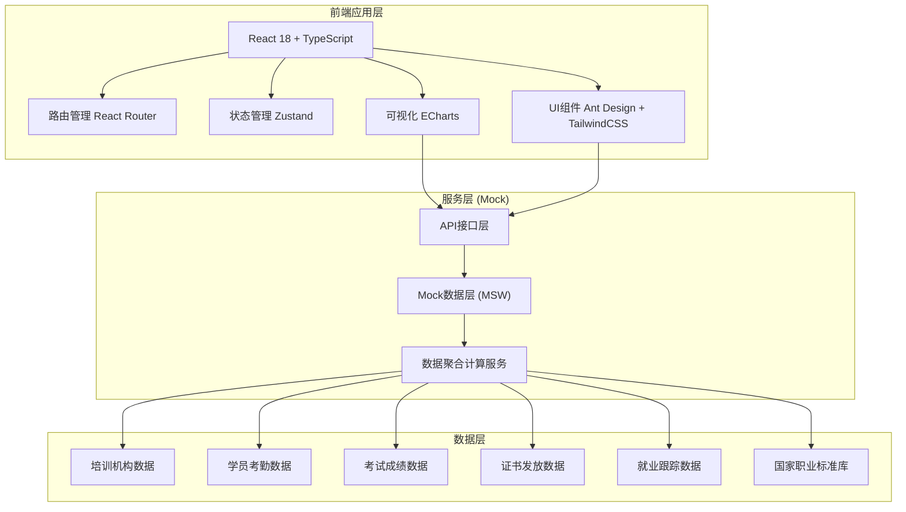
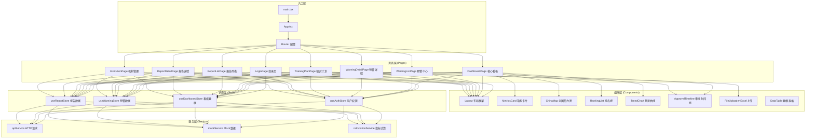
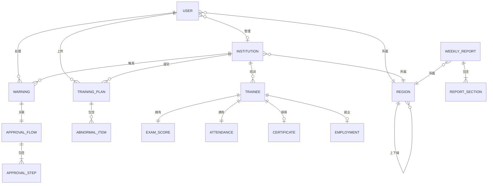

## 1. 架构设计



## 2. 技术描述

- **前端框架**：React@18 + TypeScript@5
- **构建工具**：Vite@5
- **样式方案**：TailwindCSS@3 + PostCSS + Autoprefixer
- **UI组件库**：Ant Design@5
- **图表可视化**：ECharts@5（热力图、折线图、柱状图、饼图、仪表盘）
- **状态管理**：Zustand@4（轻量级、API简洁）
- **路由管理**：React Router@6
- **数据Mock**：MSW@2（Mock Service Worker）
- **HTTP客户端**：Axios@1
- **工具库**：Lodash@4、Day.js@1、XLSX@0.18（Excel解析）
- **代码规范**：ESLint@8 + Prettier@3

## 3. 路由定义

| 路由 | 页面 | 权限 | 描述 |
|------|------|------|------|
| `/login` | 登录页 | 公开 | 用户登录、角色选择 |
| `/dashboard` | 核心数据看板 | 所有登录用户 | 全国热力图、指标总览、排名、趋势 |
| `/dashboard/province/:code` | 省份详情看板 | 省级以上 | 下钻查看地市数据 |
| `/warnings` | 预警中心 | 市级以上 | 预警列表、审批工作台 |
| `/warnings/:id` | 预警详情 | 相关审批人 | 预警详情、三级审批操作 |
| `/warnings/rules` | 预警规则配置 | 国家级管理员 | 配置预警阈值参数 |
| `/training-plan` | 培训计划校验 | 教务管理员、机构负责人 | Excel上传、校验结果展示 |
| `/reports` | 诊断报告 | 所有登录用户 | 周报列表、报告详情 |
| `/reports/:id` | 报告详情 | 所有登录用户 | 效能诊断报告详情 |
| `/institutions` | 机构管理 | 省级以上 | 机构列表、资质管理 |
| `/institutions/:id` | 机构详情 | 相关管理员 | 机构档案、历史数据 |

## 4. 核心数据类型定义

```typescript
// 培训效能核心指标
interface TrainingMetrics {
  totalTrainees: number;          // 培训总人数
  passRate: number;               // 培训合格率 (%)
  employmentRate: number;         // 就业转化率 (%)
  skillImprovementIndex: number;  // 技能提升指数
  certificateTimeliness: number;  // 证书发放及时率 (%)
  updatedAt: string;
}

// 地区维度聚合数据
interface RegionData {
  regionCode: string;             // 行政区划代码
  regionName: string;             // 地区名称
  regionLevel: 'country' | 'province' | 'city';
  metrics: TrainingMetrics;
  trend: {
    date: string;
    passRate: number;
    attendanceRate: number;
  }[];
}

// 培训机构
interface Institution {
  id: string;
  name: string;
  regionCode: string;
  level: 'primary' | 'intermediate' | 'advanced';  // 培训等级
  qualificationStatus: 'active' | 'suspended' | 'pending';
  contactPerson: string;
  contactPhone: string;
  metrics: TrainingMetrics;
}

// 一级预警
interface Warning {
  id: string;
  type: 'pass_rate' | 'employment_rate';
  level: 1;
  institutionId: string;
  institutionName: string;
  regionCode: string;
  description: string;
  threshold: number;
  actualValue: number;
  consecutiveMonths: number;
  status: 'pending' | 'processing' | 'resolved';
  createdAt: string;
  approvalFlow: ApprovalFlow;
}

// 三级审批流程
interface ApprovalFlow {
  id: string;
  warningId: string;
  currentStep: 0 | 1 | 2 | 3;  // 0:待发起 1:机构确认 2:区级复核 3:省级批准
  steps: ApprovalStep[];
  finalDecision?: 'adjust_plan' | 'suspend_qualification' | 'dismiss';
}

interface ApprovalStep {
  step: 1 | 2 | 3;
  title: string;
  role: 'institution' | 'district' | 'province';
  status: 'pending' | 'approved' | 'rejected';
  operatorName?: string;
  comment?: string;
  operatedAt?: string;
}

// 培训计划校验结果
interface PlanValidationResult {
  id: string;
  fileName: string;
  uploadedBy: string;
  uploadedAt: string;
  totalCourses: number;
  abnormalItems: AbnormalItem[];
  overallStatus: 'pass' | 'warning' | 'error';
}

interface AbnormalItem {
  courseName: string;
  itemType: 'class_hours' | 'teacher_qualification' | 'curriculum';
  standardValue: number | string;
  actualValue: number | string;
  deviation: number;  // 偏差百分比
  description: string;
  severity: 'minor' | 'major' | 'critical';
}

// 效能诊断周报
interface WeeklyReport {
  id: string;
  weekStart: string;
  weekEnd: string;
  regionCode: string;
  sections: ReportSection[];
  optimizationSuggestions: string[];
}

interface ReportSection {
  title: string;
  type: 'pass_rate_comparison' | 'employment_distribution' | 'certificate_cycle' | 'trend_analysis';
  data: any;
  analysis: string;
}

// 用户权限
interface User {
  id: string;
  username: string;
  role: 'national' | 'province' | 'city' | 'institution' | 'academic';
  regionCode: string;
  institutionId?: string;
  name: string;
}
```

## 5. 前端模块架构图



## 6. 数据模型关系


